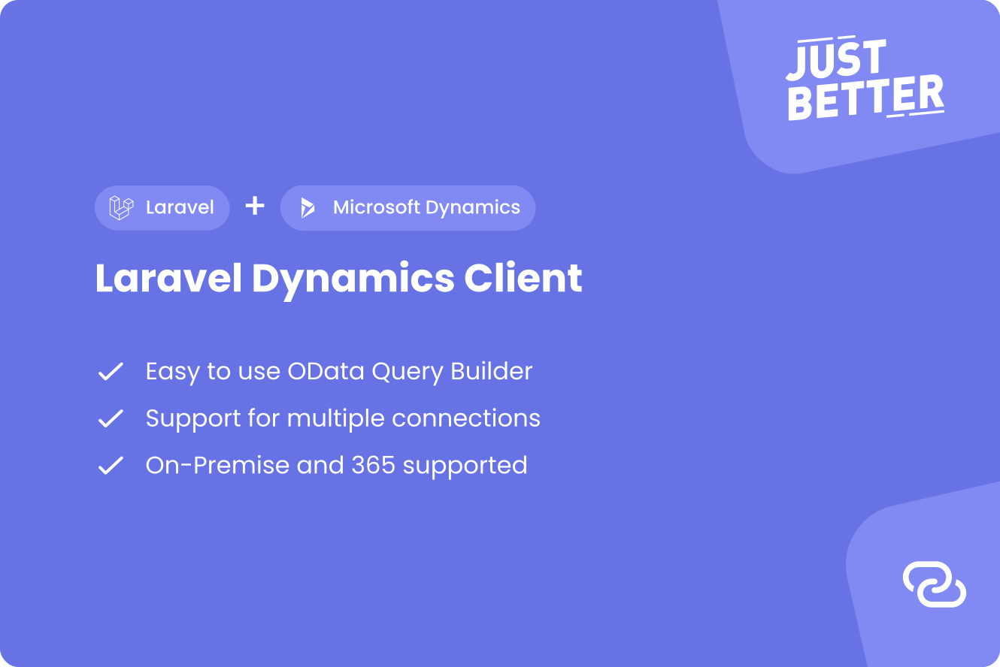

<a href="https://github.com/justbetter/laravel-dynamics-client" title="JustBetter">
    
</a>

# Laravel Dynamics Client

This package will connect you to your Microsoft Dynamics web services via OData. Custom web services can easily be
implemented and mapped to your liking. It uses the [HTTP client](https://laravel.com/docs/master/http-client) of Laravel
which means that you can easily fake requests when writing tests.

The way we interact with OData has been inspired by Laravel's Query Builder.

```php
$customer = Customer::query()->findOrFail('1000');

$customer->update([
    'Name' => 'John Doe',
]);

$customers = Customer::query()
    ->where('City', '=', 'Alkmaar')
    ->lazy();

$items = Item::query()
    ->whereIn('No', ['1000', '2000'])
    ->get();

$customer = Customer::new()->create([
    'Name' => 'Jane Doe',
]);
```

## Installation

Install the composer package.

```shell
composer require justbetter/laravel-dynamics-client
```

## Setup

Publish the configuration of the package.

```shell
php artisan vendor:publish --provider="JustBetter\DynamicsClient\ServiceProvider" --tag=config
```

## Configuration

Add your Dynamics credentials in the `.env`:

```
DYNAMICS_BASE_URL=https://127.0.0.1:7048/DYNAMICS
DYNAMICS_VERSION=ODataV4
DYNAMICS_COMPANY=
DYNAMICS_USERNAME=
DYNAMICS_PASSWORD=
DYNAMICS_PAGE_SIZE=1000
```

Be sure the `DYNAMICS_PAGE_SIZE` is set equally to the `Max Page Size` under `OData Services` in the configuration of
Dynamics. This is crucial for the functionalities of the `lazy` method of the `QueryBuilder`.

### Authentication

> **Note:** Be sure that Dynamics has been properly configured for OData.

This package uses NTLM authentication by default. If you are required to use basic auth you can change this in
your `.env`.

```
DYNAMICS_AUTH=basic
```

| Type       | Authentication Type  |
|------------|----------------------|
| On-Premise | NTLM authentication  |
| 365        | Basic authentication |

### Connections

Multiple connections are supported. You can easily update your `dynamics` configuration to add as many connections as
you wish.

```php
// Will use the default connection.
Customer::query()->first();

// Uses the supplied connection.
Customer::query('other_connection')->first();
```

## Adding web services

Adding a web service to your configuration is easily done. Start by creating your own resource class to map te data to.

```php
use JustBetter\DynamicsClient\OData\BaseResource;

class Customer extends BaseResource
{
    //
}
```

### Primary Key

By default, the primary key of a resource will default to `No` as a string. You can override this by supplying the
variable `$primaryKey`.

```php
public array $primaryKey = [
    'Code',
];
```

### Data Casting

Fields in resources will by default be treated as a string. For some fields, like a line number, this should be casted
to an integer.

```php
public array $casts = [
    'Line_No' => 'int',
];
```

### Registering Your Resource

Lastly, you should register your resource in your configuration file to let the package know where the web service is
located. This should correspond to the service name configured in Dynamics.

If your resource class name is the same as the service name, no manual configuration is needed.

> **Note:** Make sure your web service is published.

```php
return [

    /* Resource Configuration */
    'resources' => [
        Customer::class => 'CustomerCard',
    ],

];
```

## Query Builder

Querying data is easily done using the QueryBuilder.

Using the `get` method will only return the first result page. If you wish to efficiently loop through all records,
use `lazy` instead.

```php
$customers = Customer::query()
    ->where('City', '=', 'Alkmaar')
    ->lazy()
    ->each(function(Customer $customer): void {
        //
    });
```

See the `QueryBuilder` class for all available methods.

## Relations

Any relations published on a page can be accessed as well using the resource.

```php
$salesOrder = SalesOrder::query()->first();

// Get the lines via the "relation" method.
$salesLines = $salesOrder->relation('Relation_Name', SalesLine::class)->get();

// Or use the "lines" helper on the SalesOrder.
$salesLines = $salesOrder->lines('Relation_Name')->get();
```

Note that the `relation` method itself returns an instance of a query builder. This means that you can add additional where-clauses like you would be able to on a regular resource.

## Creating records

Create a new record.

```php
Customer::new()->create([
    'Name' => 'John Doe'
])
```

## Updating records

Update an existing record.

```php
$customer = Customer::query()->find('1000');
$customer->update([
    'Name' => 'John Doe',
]);
```

## Deleting records

Delete a record.

```php
$customer = Customer::query()->find('1000');
$customer->delete();
```

## Debugging

If you wish to review your query before you sent it, you may want to use the `dd` function on the builder.

```php
Customer::query()
    ->where('City', '=', 'Alkmaar')
    ->whereIn('No', ['1000', '2000'])
    ->dd();

// Customer?$filter=City eq 'Alkmaar' and (No eq '1000' or No eq '2000')
```

## Commands

You can run the following command to check if you can successfully connect to Dynamics.

```shell
php artisan dynamics:connect {connection?}
```

## Extending

If needed, it is possible to extend the provided `ClientFactory` class by creating your own. You **must** implement the `ClientFactoryContract` interface and its methods.


```php
use JustBetter\DynamicsClient\Exceptions\DynamicsException;
use JustBetter\DynamicsClient\Contracts\ClientFactoryContract;

class MyCustomClientFactory implements ClientFactoryContract
{
    public function __construct(public string $connection)
    {
        $config = config('dynamics.connections.'.$connection);

        if (! $config) {
            throw new DynamicsException(
                __('Connection ":connection" does not exist', ['connection' => $connection])
            );
        }

        $this
            ->header('Authorization', 'Bearer ' . $config['access_token'])
            ->header('Accept', 'application/json')
            ->header('Content-Type', 'application/json');
    }

    ...
}
```

You will then need to bind your custom factory as the implementation of the contract, in any of your `ServiceProvider` register method :

```php
<?php

use JustBetter\DynamicsClient\Contracts\ClientFactoryContract;

class AppServiceProvider extends ServiceProvider
{
    /**
     * Register the service provider.
     *
     * @return void
     */
    public function register()
    {
        $this->app->bind(ClientFactoryContract::class, MyCustomClientFactory::class);
    }
}
```

## Fake requests to Dynamics

When writing tests you may find yourself in the need of faking a request to Dynamics. Luckily, this packages uses the
HTTP client of Laravel to make this very easy.

In order to fake all requests to Dynamics, you can call the method `fake` on any resource.

> The `fake` method will fake **all** requests to Dynamics, not just the endpoint of the used resource.

```php
<?php

use JustBetter\DynamicsClient\OData\BaseResource;

BaseResource::fake();
```

This method will fake the Dynamics configuration and removes sensitive information like usernames and passwords. Only
the company name will remain in order to easily test with multiple connections.

```php
<?php

use Illuminate\Support\Facades\Http;
use JustBetter\DynamicsClient\OData\Pages\Item;

Item::fake();

Http::fake([
    'dynamics/ODataV4/Company(\'default\')/Item?$top=1' => Http::response([
        'value' => [
            [
                '@odata.etag' => '::etag::',
                'No' => '::no::',
                'Description' => '::description::',
            ],
        ],
    ]),
]);

$item = Item::query()->first();
```

## Contributing

Please see [CONTRIBUTING](.github/CONTRIBUTING.md) for details.

## Security Vulnerabilities

Please review [our security policy](../../security/policy) on how to report security vulnerabilities.

## Credits

- [Vincent Boon](https://github.com/VincentBean)
- [Ramon Rietdijk](https://github.com/ramonrietdijk)
- [All Contributors](../../contributors)

## License

The MIT License (MIT). Please see [License File](LICENSE.md) for more information.

<a href="https://justbetter.nl" title="JustBetter">
    
</a>
