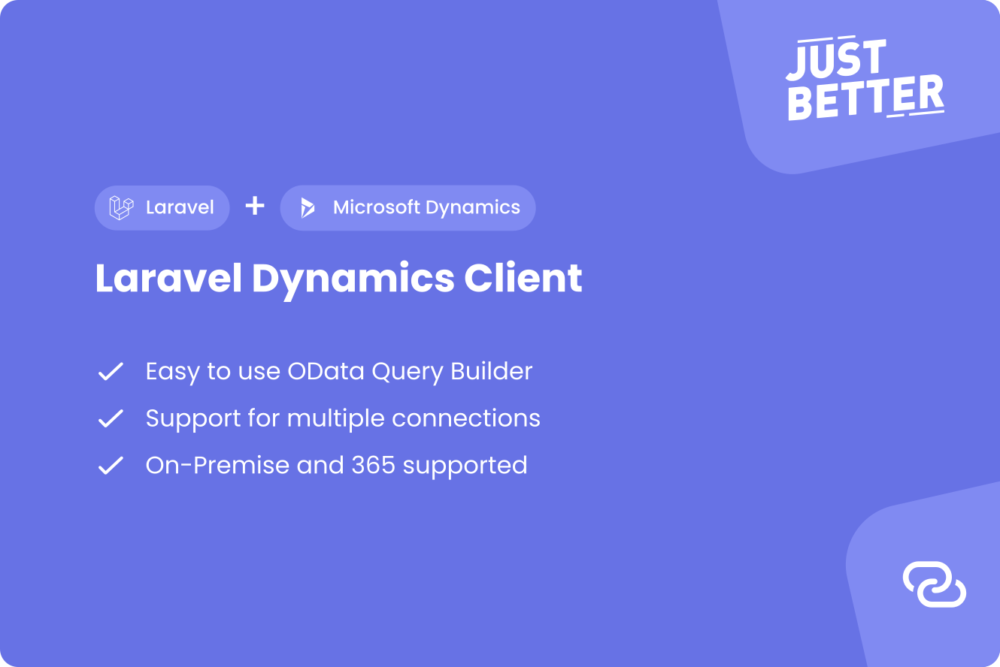

<a href="https://github.com/justbetter/laravel-dynamics-client" title="JustBetter">
    
</a>

# Laravel Dynamics Client

This package connects your Laravel application to the Microsoft Dynamics 365 Business Central API. It authenticates
with OAuth client credentials and uses the [HTTP client](https://laravel.com/docs/master/http-client) of Laravel, which
means responses, retries and fakes work exactly as you already know them.

```php
use JustBetter\DynamicsClient\Client\Dynamics;
use JustBetter\DynamicsClient\Data\Entity;
use JustBetter\DynamicsClient\Query\QueryBuilder;

$dynamics = app(Dynamics::class);

$customers = $dynamics->entities('customers', QueryBuilder::make()
    ->where('city', 'Alkmaar')
    ->orderBy('displayName')
    ->get());

$customer = $customers->first();

$customer->displayName = 'John Doe';

$dynamics->entity($customer)->update();
```

> [!IMPORTANT]
> Upgrading from 1.x? See [UPGRADING](UPGRADING.md).

## Requirements

- PHP 8.4 or higher
- Laravel 12.0 or 13.0

## Installation

Install the composer package.

```shell
composer require justbetter/laravel-dynamics-client
```

Publish the configuration of the package.

```shell
php artisan vendor:publish --provider="JustBetter\DynamicsClient\ServiceProvider" --tag=config
```

## Configuration

Add your Dynamics credentials to your `.env`:

```dotenv
DYNAMICS_TENANT_ID=
DYNAMICS_ENVIRONMENT=
DYNAMICS_COMPANY_ID=
DYNAMICS_OAUTH_CLIENT_ID=
DYNAMICS_OAUTH_CLIENT_SECRET=
```

### OAuth

When using D365 cloud with [Microsoft identity platform](https://learn.microsoft.com/en-us/entra/identity-platform/v2-oauth2-auth-code-flow) your redirect uri will be: `https://login.microsoftonline.com/<tenant>/oauth2/v2.0/token`
and your base url should be `https://api.businesscentral.dynamics.com/v2.0/<tenant>/<environment>`.

### URL templates

Both the API URL and the token URL are templates. Every `{key}` is replaced with the parameter of the same name:

```php
'base_url' => 'https://api.businesscentral.dynamics.com/v2.0/{tenant_id}/{environment}/api/{api}/companies({company_id})',
'token_url' => 'https://login.microsoftonline.com/{tenant_id}/oauth2/v2.0/token',

'parameters' => [
    'tenant_id' => env('DYNAMICS_TENANT_ID'),
    'environment' => env('DYNAMICS_ENVIRONMENT'),
    'api' => env('DYNAMICS_API', 'v2.0'),
    'company_id' => env('DYNAMICS_COMPANY_ID'),
],
```

## Parameter overrides

Every parameter can be overridden.

```php
$dynamics = app(Dynamics::class);

$dynamics
    ->tenantId('::tenant-id::')
    ->environment('Production')
    ->api('justbetter/general/v1.0')
    ->companyId('::company-id::');

// Any other placeholder, or several at once.
$dynamics->set('environment', 'Sandbox');
$dynamics->parameters(['environment' => 'Sandbox', 'api' => 'v2.0']);

$dynamics->reset();
```

### Companies

Rather than passing company IDs, map a friendly name to an ID in your configuration:

```php
'companies' => [
    'acme' => env('DYNAMICS_COMPANY_ACME_ID'),
    'other' => env('DYNAMICS_COMPANY_OTHER_ID'),
],
```

Select one with `company()`, which resolves the name and sets the `company_id` parameter:

```php
$dynamics->company('acme')->entities('customers');
```

## Multiple connections

Multiple connections are supported. Add as many as you wish to the `connections` array of your configuration and
select one with `connection()`:

```php
$dynamics->connection('other')->entities('customers');
```

## Requests

The client exposes the HTTP verbs directly. Every method returns the `Illuminate\Http\Client\Response`,.

```php
$response = $dynamics->get('customers', ['$top' => 10]);
$response = $dynamics->post('customers', ['displayName' => 'John Doe']);
$response = $dynamics->patch('customers(::id::)', ['displayName' => 'Jane Doe']);
$response = $dynamics->put('customers(::id::)', ['displayName' => 'Jane Doe']);
$response = $dynamics->delete('customers(::id::)');

$response->throw();
```

Add headers for a single request with `header()` or `headers()`. Headers are cleared after the request is sent.

```php
$dynamics->header('Prefer', 'return=representation')->post('customers', ['displayName' => 'John Doe']);
```

## Entities

`entities()` maps the `value` array of a response onto `Entity` objects that remember the endpoint they came from:

```php
$customers = $dynamics->entities('customers');

$customer = $customers->first();

$customer->displayName;      // Attributes are accessed as properties
$customer->id();             // The "id" attribute
$customer->etag();           // The "@odata.etag" attribute
$customer->endpoint();       // "customers"
$customer->url();            // "customers(::id::)"
```

Use `Entity::from()` to build one from a single-record response, for example after a create:

```php
use JustBetter\DynamicsClient\Data\Entity;

$response = $dynamics->post('customers', ['displayName' => 'John Doe'])->throw();

$customer = Entity::from($response, ['endpoint' => 'customers']);
```

### Updating and deleting

Scope the client to an entity to derive the URL and the `If-Match` header from it. The scope lasts for one request.

```php
$customer->displayName = 'Jane Doe';

$dynamics->entity($customer)->update();
```

`update()` without arguments sends only the changed attributes. You may also pass an array:

```php
$dynamics->entity($customer)->update(['displayName' => 'Jane Doe']);
```

Delete the scoped entity by calling `delete()` without a path:

```php
$dynamics->entity($customer)->delete();
```

If the entity was read from another endpoint than the one you want to write to, pass the endpoint as the second
argument:

```php
$dynamics->entity($customer, 'customers')->update();
```

### Concurrency and `If-Match`

Business Central requires an `If-Match` header on every write. The client adds one for you:

1. The header you set yourself with `header('If-Match', $etag)` wins.
2. Otherwise the ETag of the scoped entity is used, so the write fails when the record changed in the meantime.
3. Otherwise `If-Match: *` is sent, which overwrites the record regardless of its version.

That means an unscoped `patch()`, `put()` or `delete()` is an unconditional write by default. Scope the call to an
entity when you care about lost updates, or narrow it yourself:

```php
$dynamics->header('If-Match', $etag)->patch('customers(::id::)', ['displayName' => 'Jane Doe']);
```

## Lazy pagination

Use `lazy()` to walk every record of an endpoint without holding them all in memory. It pages with `$top` and `$skip`
until a page comes back with fewer records than the page size, and yields each entry of the response's `value` array
as an array.

```php
$dynamics
    ->lazy('customers', ['$orderby' => 'id'])
    ->each(function (array $customer): void {
        //
    });
```

The page size defaults to the connection's `page_size`; pass a third argument to override it per call.

```php
$dynamics->lazy('customers', ['$orderby' => 'id'], 100);
```

Use `lazyEntities()` when you want `Entity` objects back:

```php
$dynamics
    ->lazyEntities('customers', ['$orderby' => 'id'])
    ->each(function (Entity $customer): void {
        //
    });
```

## Query builder

`QueryBuilder` builds the OData query parameters.

```php
use JustBetter\DynamicsClient\Query\QueryBuilder;

$query = QueryBuilder::make()
    ->select(['id', 'number', 'displayName'])
    ->where('city', 'Alkmaar')
    ->where('balance', '>', 100)
    ->whereIn('number', ['1000', '2000'])
    ->whereNotNull('phoneNumber')
    ->orderByDesc('lastModifiedDateTime')
    ->take(50)
    ->get();

$customers = $dynamics->entities('customers', $query);
```

```php
QueryBuilder::make()
    ->where('city', 'Alkmaar')
    ->where('balance', '>', 100)
    ->orWhere('blocked', 'All')
    ->get();

// $filter=city eq 'Alkmaar' and (balance gt 100 or blocked eq 'All')
```

## Availability

This client can prevent requests from going to Dynamics when it is giving HTTP status codes 503, 504 or timeouts. This can be configured per connection in the `availability` settings. Enable the `throw` option to prevent any requests from going to Dynamics.

## Testing

Call `Dynamics::fake()` to configure a connection with placeholder credentials and stub the OAuth token request, then
fake the HTTP client for the endpoints you call. No real credentials are needed and the URLs are stable, so you can
key your fakes on them.

```php
use Illuminate\Support\Facades\Http;
use JustBetter\DynamicsClient\Client\Dynamics;

Dynamics::fake();

Http::fake([
    'dynamics/customers*' => Http::response([
        'value' => [
            [
                '@odata.etag' => '::etag::',
                'id' => '::id::',
                'displayName' => 'John Doe',
            ],
        ],
    ]),
]);

$customers = app(Dynamics::class)->entities('customers');
```

## Commands

Run the following command to check whether you can successfully connect to Dynamics. It reads the company of the
connection and prints its name.

```shell
php artisan dynamics:connect {connection?}
```

## Quality

To ensure the quality of this package, run the following command:

```shell
composer quality
```

This will execute the following tasks:

1. Runs the test suite
2. Checks for any issues using static code analysis
3. Checks if the code is correctly formatted
4. Checks if code coverage is at 100%
5. Checks for possible improvements using Rector

## Contributing

Please see [CONTRIBUTING](.github/CONTRIBUTING.md) for details.

## Security Vulnerabilities

Please review [our security policy](../../security/policy) on how to report security vulnerabilities.

## Credits

- [Vincent Boon](https://github.com/VincentBean)
- [Ramon Rietdijk](https://github.com/ramonrietdijk)
- [All Contributors](../../contributors)

## License

The MIT License (MIT). Please see [License File](LICENSE.md) for more information.

<a href="https://justbetter.nl" title="JustBetter">
    
</a>
